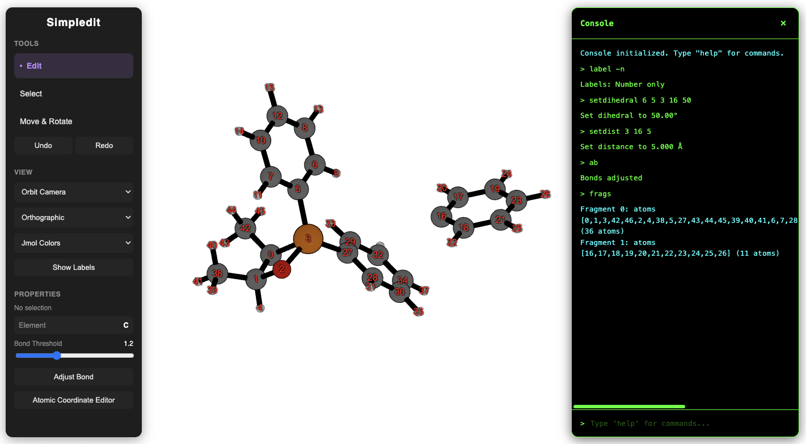

  

---

# $${\Large \text{simpl}}{\Large \color{blue}\text{edit}}$$

This project is a simple JavaScript-based molecular editor. It was created because only a few JS-based molecular editors are currently available. The current version is a pre-alpha prototype with a very minimal user interface.

Avogadro2 and the [rowan](https://labs.rowansci.com/editor) are excellent alternatives. However, this project was initiated as a foundation for future work and experimentation.

For detailed usage instructions, please refer to the [usage.md](./usage.md) file.

## Try it Online

**Live Demo**: [https://kangmg.github.io/simpledit/](https://kangmg.github.io/simpledit/)

## Features

- **Interactive 3D Editor**: Click-and-drag interface for building molecules
- **Selection Tools**: Rectangle and lasso selection modes
- **Geometry Manipulation**: Adjust bond lengths, angles, and dihedral angles
- **Command Console**: Terminal-style interface with 18+ commands for advanced control
- **Multiple Camera Modes**: Orbit and trackball controls with perspective/orthographic projection
- **Undo/Redo**: Full history support for all operations
- **Fragment Management**: Select and manipulate molecular fragments
- **Bond Control**: Manual bonding and automatic bond detection with adjustable threshold

## Future Directions

- LLM integration  
- rdkit-js integration for 2D/SMILES sync and broader file format support  
- ASE integration for in-editor calculations with community packages/calculators
- Additional molecule building features
    - ligand substitution
    - hybridization & steric number aware positioning
    - multi-coordinate driving deformations
